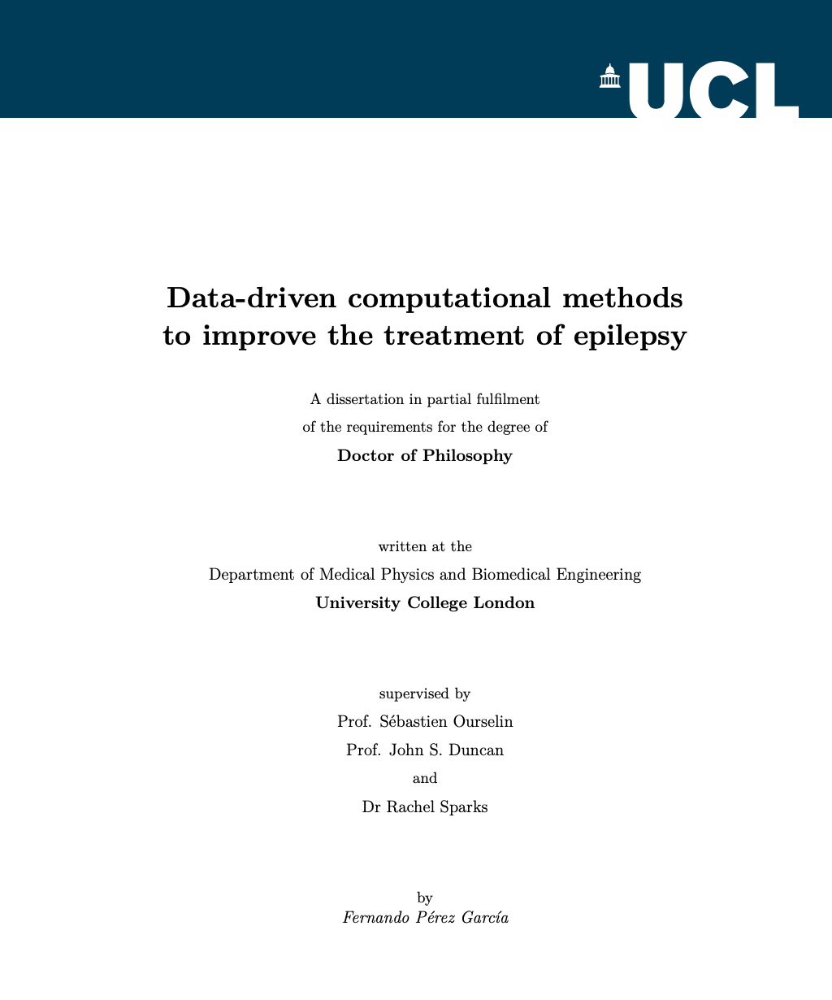

# PhD Thesis of Fernando Pérez-García

*Towards a data-driven treatment of epilepsy: computational methods to overcome low-data regimes in clinical settings*.

My thesis is publicly available at [UCL Discovery](https://discovery.ucl.ac.uk/id/eprint/10164304/).

## Acknowledgments

This thesis is built on top of [Prof. Tom Vercauteren](https://www.kcl.ac.uk/people/tom-vercauteren)'s [template](https://github.com/tvercaut/TomThesisTemplate).
